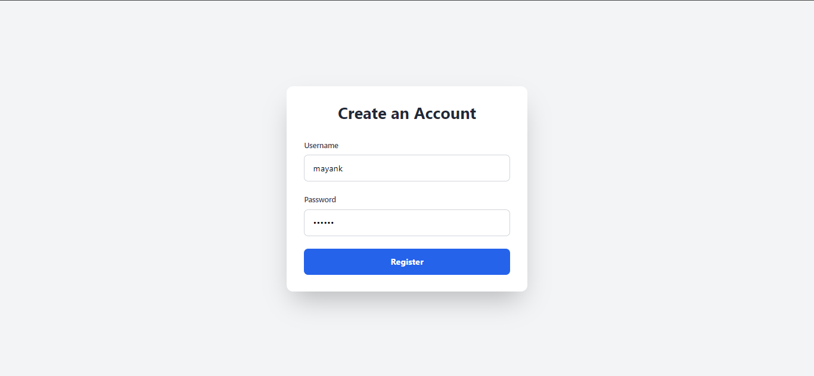

# Biometric-WebAuthn

### Overview

This project is a web authentication system that uses WebAuthn and passkeys to provide a secure and convenient login mechanism. The system allows users to register, authenticate, and manage their passkeys, using biometrics such as fingerprints or facial recognition instead of traditional passwords.

### What is WebAuthn?

Web Authentication (WebAuthn) is a web standard published by the World Wide Web Consortium (W3C). It is part of the FIDO2 set of specifications and allows servers to register and authenticate users using public key cryptography instead of passwords. WebAuthn enhances security by providing strong, phishing-resistant authentication.

### What are Passkeys?

Passkeys are modern authentication methods that use biometrics or secure devices to verify a user's identity. They eliminate the need for passwords, reducing the risk of password-related attacks such as phishing, credential stuffing, and brute force attacks. Passkeys can be stored on devices like smartphones, laptops, or hardware security keys, and are used to authenticate users securely and conveniently.

### Features

* **User Registration**: Allows users to register with a username and password.

<figure><figcaption></figcaption></figure>

* **Passkey Registration**: Users can register a passkey for biometric authentication.

<figure><figcaption></figcaption></figure>

* **User Login**: Users can log in using their registered passkeys.

<figure><figcaption></figcaption></figure>

* **Passkey Management**: Users can manage their passkeys, including registering new passkeys, removing existing ones, or updating preferences.

<figure><figcaption></figcaption></figure>

### Project Installation Guide

#### Prerequisites

* Node.js (v14 or later)
* npm (Node Package Manager)

#### Installation Steps

1.  **Clone the Repository**

    ```sh
    git clone https://github.com/mayankyadav1711/Biometric-WebAuthentication.git
    cd web-authentication
    ```
2.  **Install Dependencies**

    ```sh
    npm install
    ```
3.  **Run the Server**

    ```sh
    node index.js
    ```
4. **Access the Application** Open your web browser and navigate to `http://localhost:3000`.

### File Structure

```java
Biometric-WebAuthentication
├─ index.js
├─ package-lock.json
├─ package.json
└─ public
   ├─ index.html
   ├─ login.html
   ├─ profile.html
   └─ signup.html
```

#### Explanation of Key Files

* **index.js**: The main server-side file that handles HTTP requests and WebAuthn logic using Express.js.
* **package.json**: Contains metadata about the project and its dependencies.
* **package-lock.json**: Locks the exact versions of dependencies for consistent installs.
* **public/index.html**: The main landing page after a successful login (Secured).
* **public/signup.html**: The sign-up page for user registration.
* **public/profile.html**: The profile page where users can register their passkeys.
* **public/login.html**: The login page for authenticating using passkeys.

### Application Workflow

#### User Registration

1. The user navigates to `signup.html`.
2. Fills out the form with a username and password.
3. The server creates a new user entry and redirects the user to `profile.html`.

#### Passkey Registration

1. On `profile.html`, the user clicks the "Register" button.
2. The server generates a WebAuthn registration challenge.
3. The user completes the challenge using their biometric device.
4. The server verifies the response and registers the passkey.

#### User Login

1. The user navigates to `login.html` and enters their User ID.
2. The server generates a WebAuthn login challenge.
3. The user completes the challenge using their biometric device.
4. The server verifies the response and logs in the user, redirecting to `index.html`.

### Application of this Project

This project can be applied to any web application requiring secure authentication. It is particularly useful for:

* **Financial Services**: Secure customer login for banking and financial applications.
* **Healthcare**: Protecting sensitive patient data with secure login mechanisms.
* **Enterprise Systems**: Ensuring secure employee access to corporate resources.
* **Consumer Applications**: Providing a seamless and secure login experience for online services and platforms.

## Check it out:

* 📹 YouTube Demo:[ ](https://youtu.be/LyIgccgM1K4)[https://youtu.be/LyIgccgM1K4](https://youtu.be/LyIgccgM1K4)
* 💻 Source Code : [https://github.com/mayankyadav1711/Biometric-WebAuthentication](https://github.com/mayankyadav1711/Biometric-WebAuthentication)
* Connect with me : [https://www.linkedin.com/in/mayankyadav17/](https://www.linkedin.com/in/mayankyadav17/)
